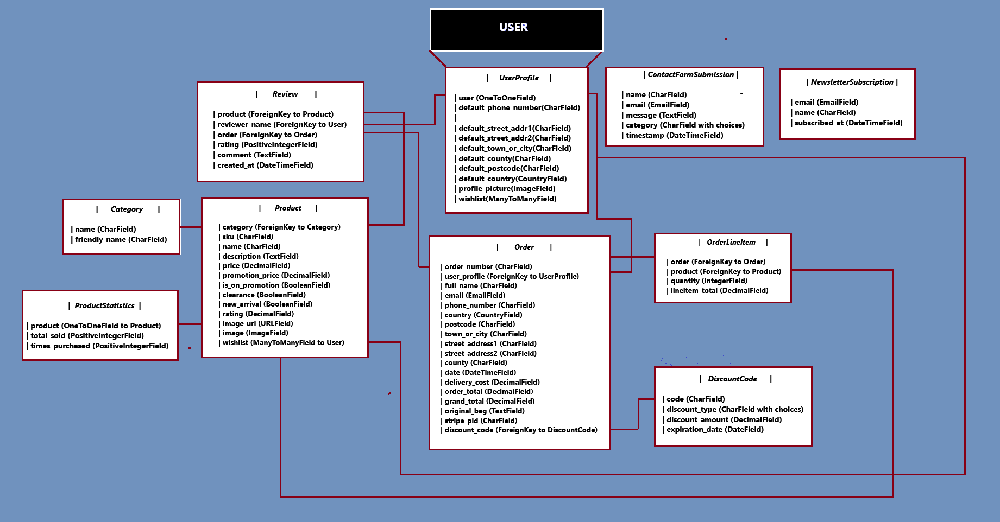

# Decked Out

## A Trading Card Game E-commerce Store
> A trading card game e-commerce store that sells products for both the YuGiOh! TCG and thE Pokemon TCG

### - Created by Diarmuid Sheeran

## Click the link below to view the live site:
>  [Decked Out's Live Site](https://decked-out-tcg-store-b1147b8f9a0a.herokuapp.com/)

## Table of Contents
1. [Decked Out](#decked-out)
2. [Site Description](#site-description)
    - [Business Model](#business-model)
        - [Business Overview](#business-overview)
        - [Site User](#site-user)
        - [Goals for the Website](#goals-for-the-website)
        - [Marketing Strategy](#marketing-strategy)
    - [SEO](#seo)
3. [Implementing the Agile Approach](#implementing-the-agile-approach)
    - [The Agile Aproach](#sites-agile-approach)
    - [Link to User Stories](#user-stories-link)
4. [Project Design](#project-design)
    - [UX](#ux)
        - [Colour Pallete](#colour-pallete)
        - [Wireframes](#wireframes)
        - [Database](#database)
5. [Site's Look and Features](#sites-look-and-features)
    - [Home](#home)
    - [User Verification](#user-verification)
    - [User Profiles](#user-profiles)
    - [Store](#store)
    - [Product Details](#product-details)
    - [Product Reviews](#product-reviews)
    - [Wishlists](#wishlists)
    - [Create Products](#create-products)
    - [Edit Products](#edit-products)
    - [View Product Statistics](#view-product-statistics)
    - [Create Discount Codes](#create-discount-codes)
    - [Send Newsletters](#send-newsletters)
    - [FAQ's](#faqs)
    - [View Contact Form Submissions](#view-contact-form-submissions)
    - [Shopping Bag](#shopping-bag)
    - [Checkout](#checkout)
    - [Checkout Success and Order History](#checkout-success-and-order-history)
6. [Testing](#testing)
7. [Technologies Used](#technologies-used)
    - [Languages](#languages)
    - [Frameworks](#frameworks)
    - [Other Technologies](#other-technologies)
8. [Deployment](#deployment)
9. [Future Features](#future-features)
10. [Credits](#credits)

## Site Description
* The goal of Decked out is to be an e-commerce store that allows users to purchase YuGioh and Pokemon products. 
* The site allows users to create their own account, sign in and logout.
* Authenticated users have their own profile pages that shows there order history, wishlisted products and can add default delivery information. Every logged in user can also upldoad their own profile picture to personalise their profile.
* The site allows users to interact with products by adding/removing them from their own personal wishlists. Site users can also leave reviews on products they have previously purchased.
* Users can view the stores best sellers, promotion, clearnece and new arrival products on the home page with the addition of being able to sign up for the sites newsletter.
* The site contains a products page that allows users to view all of the products in the store at once or if they so wish they can shop by sorting by either YuGiOh! or Pokemon products.
* Users have the ability to delete their account, deleting all of their information.
* Users can add, edit quantities or remove products from their shopping bag.
* The site allows users to enter a discount code to save money on their orders also site users can securly checkout using the stripe payment network. On successful completion of an order the user is emailed a copy of their order-confirmation.
* The Admin of the site is given control over creating/editing their own products and also have the abillity to view product stastics, create discount codes, send newsletters, and view contact form submissions. The Admin also has the ability delete products. 
* The site was created for the Code Institutes PP5 to demonstrate an agile apporach to creating a functioning e-commerce website.
### Business Model
#### Business Overview
Decked Out is a B2C e-commerce platform specializing in trading card games, specifically Yu-Gi-Oh! and Pokémon. Our goal is to become the go-to destination for enthusiasts and collectors alike, offering a wide range of products through our online store.

Products:

Decked Out will offer a diverse selection of Yu-Gi-Oh! and Pokémon trading card game products, including booster packs, starter decks, accessories, and merchandise. Our pricing structure will range from low to medium to high end, catering to both casual players and serious collectors.

Benefits for the Business Owner:

1. Scalability: The online platform allows for easy scalability as the business grows. We can expand our product offerings and reach new markets without the constraints of a physical location.

2. Global Reach: By operating online, Decked Out can cater to customers globally, tapping into the worldwide trading card game community.

3. Low Startup Costs: Starting an e-commerce store requires relatively low initial investment, allowing us to allocate more resources towards customer acquisition, such as advertising and marketing campaigns.

4. Impulse Buying: The affordable price point of our products encourages impulse buying, attracting customers who may be considering purchasing trading card game products.

Cons of the Business Model:

1. Customer Acquisition: Initial customer acquisition may be challenging due to saturation in the trading card game market. We'll need to implement a robust marketing strategy to stand out from competitors and attract customers.

2. Brand Building: Establishing a strong brand presence takes time and effort. Immediate results are unlikely without a well-planned marketing strategy focused on building brand awareness and credibility.

3. Trust and Loyalty: Without a physical storefront, building trust and loyalty with customers may be more challenging. Offering discounts, promotions, and excellent customer service will be essential in establishing a loyal customer base.

[Back to Top](#table-of-contents) | [Jump to Credits](#credits)

#### Site User:
Decked Out's typical site users are trading card game enthusiasts, predominantly male, aged between 12 and 40, who have a passion for collecting and playing Yu-Gi-Oh! and Pokémon trading card games. They are likely to be avid fans of the respective franchises and enjoy engaging with the community surrounding these games.

User 1:

* The primary user demographic for Decked Out includes males aged between 12 and 40 who are         passionate about trading card games like Yu-Gi-Oh! and Pokémon. These users are likely to have a deep interest in collecting rare cards, building competitive decks, and participating in tournaments and events within the trading card game community.

User 2:

* In addition to the primary user demographic, partners of trading card game enthusiasts may also visit Decked Out to purchase gifts for them. These users may not be as familiar with trading card games but are seeking products and accessories that would make ideal gifts for their loved ones who are passionate about Yu-Gi-Oh! and Pokémon.

[Back to Top](#table-of-contents) | [Jump to Credits](#credits)

#### Goals for the Website:
Decked Out aims to create an intuitive and user-friendly online platform with the following goals:

1. Seamless Navigation: Ensure the website is easy to navigate, allowing users to quickly find the products they're looking for and proceed to checkout effortlessly.

2. Product Satisfaction: Provide users with a diverse range of authentic Yu-Gi-Oh! and Pokémon trading card game products that meet their expectations in terms of quality and authenticity.

4. Efficient Checkout Process: Enable users to complete transactions swiftly and securely, enhancing the overall shopping experience.

5. User Profiles: Allow users to create profiles where they can view past orders, update their information, and manage their preferences within a wishlist of products.

[Back to Top](#table-of-contents) | [Jump to Credits](#credits)

#### Marketing Strategy:
Decked Out's marketing strategy focuses on reaching and engaging with its target audience effectively:

1. Social Media Promotion: Utilize platforms like Facebook to promote the store, engage with users, and encourage sharing and interaction within the trading card game community.

2. Soft Launch Sale: Host a soft online launch sale to attract early adopters and incentivize initial purchases from prospective customers.

3. Email Marketing: Collect subscribers through the site and send out emails of offers, promotions, and updates to encourage repeat business.

4. Paid Advertising: Consider using paid advertising channels such as Google Ads and Facebook Ads to target the desired demographic and drive traffic to the site, focusing on high-performing ad campaigns.

5. Influencer Partnerships: Depending on budget, collaborate with influencers within the trading card game niche to promote Decked Out's products to their audience, leveraging their influence to increase brand visibility and attract potential customers. Target influencers with a following of at least 10k in the trading card game community for optimal reach and engagement.

[Back to Top](#table-of-contents) | [Jump to Credits](#credits)

### SEO
#### SEO Project Planning for Decked Out:
Upon finalizing the decision to establish Decked Out as a trading card game store, the focus shifted towards devising an effective SEO strategy to enhance the visibility and reach of the online platform. The following steps were undertaken to plan the SEO project:

1. Research and Analysis: Utilized Google Trends to identify popular search terms within the trading card game community. Additionally, employed SEO Quake to analyze competitors' strategies and identify areas of strength.

2. Keyword Research: Conducted comprehensive keyword research using Wordtracker.com, leveraging a trial subscription to maximize insights. Compiled a list of both short-tail and long-tail keywords tailored to the trading card game niche.

Keywords:
Short-tail - Yu-Gi-Oh!, Pokémon TCG, Trading Card Games, Booster Packs, Starter Decks, Collectible Cards, Card Sleeves, Deck Boxes, Tournaments, Online Store
Long-tail - Rare Yu-Gi-Oh! cards for sale, Pokémon TCG booster packs online, Best deals on trading card game accessories, Competitive deck building tips, Yu-Gi-Oh! tournament strategies

1. Keyword Implementation: Strategically integrated the short-tail and long-tail keywords across the Decked Out website to optimize content relevance and improve search engine rankings. These keywords were strategically placed in page titles, meta descriptions, headers, and throughout product descriptions.

2. HTML Tag Optimization: Ensured proper utilization of HTML tags, including the strong tag where appropriate, to emphasize key phrases and improve readability for search engine crawlers. Additionally, ensured that all internal and external links were accurately described to enhance user experience and SEO performance.

By implementing a strategic SEO plan tailored to the trading card game niche, Decked Out aims to enhance its online presence, attract qualified traffic, and establish itself as a leading destination for Yu-Gi-Oh! and Pokémon enthusiasts.

#### Sitemap.xml
I generated a sitemap for the site so that once ready engines like google can search it effectively.

#### Robots.txt
I generated a robots.txt file so that google could crawl the site. I have blocked off the accounts app as there is no benefit for google to crawl those pages.

#### Sites Favicon:
For the site, I used the back of a Yu-Gi-Oh! card as the favicon to add a touch of authenticity and resonate with the trading card game theme.

#### Facebook Business page:
Below is a link to the sites Business page:
> [Decked Out's Business Facbook Page](https://www.facebook.com/profile.php?id=61556460457145)

Facebook tends to find and take down fake business sites. In the eventuality of this happening, below is a screenshot of the store business Facebook page as proof of creation.

>

 

[Back to Top](#table-of-contents) | [Jump to Credits](#credits)

## Implementing the Agile Approach
### Sites Agile Approach
#### To ensure an organized and flexible development process for the Decked Out e-commerce project, I have adopted an Agile methodology. Here are the steps I've taken to implement this approach:
* I started by defining the project's scope and objectives. I identified the core functionalities and features that would be essential for the e-commerce store.
* Each major feature or functionality was expressed as a epic, which was broken down into multiple user stories written from the perspective of an end-user or an admin user. For example: "As a shopper I want to be able to view a list of products and select some to purchase."
* I converted each epic and user story into a GitHub issue. Each issue includes a clear description of the feature, its tasks, and any relevant details. I assigned labels such as "Must Have", "Should Have" to indicate priority.
* I created a Kanban board with four columns: "To Do," "In Progress," "Done," and "Nice to Have." This board serves as the projects task management indicator.
* This approach ensured I was tackling one epic's user story set of related issues at a time. This allowed me to deliver working functionality in increments as to not get distracted and finish the targeted task.
* The project could allow collaboration among team members if needed. Each issue was assigned to me but could be assigned to other team members if the project was a team project.
* As issues are started they are moved to the "In Progress" column, and when they are completed they are moved to the "Done" column.

**By following this Agile approach, I have aimed to deliver a high-quality, user-focused e-commerce site to meet user expectations and deliver a compelling online experience.**

### User Stories Link
> [Link to Epics and User Stories Board](https://github.com/users/DiarmuidSheeran/projects/8/views/1?visibleFields=%5B%22Title%22%2C%22Assignees%22%2C%22Status%22%2C%22Labels%22%5D)

[Back to Top](#table-of-contents) | [Jump to Credits](#credits)

## Project Design:
### UX
#### Colour Pallete

I have incorporated a carefully selected color palette throughout the website, aimed at creating a visually appealing design, allowing for a more streamlined and user-friendly experience.
>

#### Wireframes

With the idea for the website planned, I began creating wireframes to depict a more narrowed down outlook for how the differnet pages depending on functionality should look throught the site:
>
>
>
>
>
>

#### Database

The project relies on a PostgreSQL database hosted on ElephantSQL. Its web interface features a convenient SQL query console. The Database URL, inclusive of the API key, is securely stored as an environment variable within the Heroku platform.

 
Below you can find the database schema for the site:

>

 

[Back to Top](#table-of-contents) | [Jump to Credits](#credits)

## Site's Look and Features

### Home

[Back to Top](#table-of-contents) | [Jump to Credits](#credits)

### User Verification

[Back to Top](#table-of-contents) | [Jump to Credits](#credits)

### User Profiles

[Back to Top](#table-of-contents) | [Jump to Credits](#credits)

### Store

[Back to Top](#table-of-contents) | [Jump to Credits](#credits)

### Product Details

[Back to Top](#table-of-contents) | [Jump to Credits](#credits)

### Product Reviews

[Back to Top](#table-of-contents) | [Jump to Credits](#credits)

### Wishlists

[Back to Top](#table-of-contents) | [Jump to Credits](#credits)

### Create Products

[Back to Top](#table-of-contents) | [Jump to Credits](#credits)

### Edit Products

[Back to Top](#table-of-contents) | [Jump to Credits](#credits)

### View Product Statistics

[Back to Top](#table-of-contents) | [Jump to Credits](#credits)

### Create Discount Codes

[Back to Top](#table-of-contents) | [Jump to Credits](#credits)

### Send Newsletters

[Back to Top](#table-of-contents) | [Jump to Credits](#credits)

### FAQ's

[Back to Top](#table-of-contents) | [Jump to Credits](#credits)

### View Contact Form Submissions

[Back to Top](#table-of-contents) | [Jump to Credits](#credits)

### Shopping Bag

[Back to Top](#table-of-contents) | [Jump to Credits](#credits)

### Checkout

[Back to Top](#table-of-contents) | [Jump to Credits](#credits)

### Checkout Success and Order History

[Back to Top](#table-of-contents) | [Jump to Credits](#credits)

[Back to Top](#table-of-contents) | [Jump to Credits](#credits)

## Testing
### Link to testing.md file
>  [Testing Markdown Link](https://github.com/DiarmuidSheeran/decked-out-pp-5/blob/main/TESTING.md)

[Back to Top](#table-of-contents) | [Jump to Credits](#credits)

## Technologies Used:
### Languages:

* HTML5
* CSS
* Javascript
* Python

### Frameworks:

* Django
* Bootstrap

### Other Technologies:

* [AWS S3 and IAM](https://aws.amazon.com/?nc2=h_lg)- Used to host static and media files for this project and IAM for the permissions based roles for accessing the S3 buckets.
* [Gitpod](https://www.gitpod.io/)- For writing and test code
* [GitHub](https://github.com/)- For hosting the source code
* [Git](https://git-scm.com/)- Used for version control throughout the project and to ensure a good clean record of work done was maintained. 
* [Heroku](https://id.heroku.com/)- Used for deploying the project
* [Elephant Sql](https://customer.elephantsql.com/)- Used for hosting the database
* [Fontawesome](https://fontawesome.com/)- Used for icon within the site
* [Google Chrome Dev Tools](https://developer.chrome.com/docs/devtools/)- Used for testing the site
* [W3C Markup Validation Service](https://validator.w3.org/)- Used to validate the html
* [W3C CSS Validation Service(Jigsaw)](https://jigsaw.w3.org/css-validator/#validate_by_input)- Used for validating the css
* [PEP8 linter](https://pep8ci.herokuapp.com/)- Used for validating the python code
* [Js hint](https://jshint.com/)- Used for validating the javascript code
* Microsoft Paint was used in the making of the wireframes and the databases schema.

 

[Back to Top](#table-of-contents) | [Jump to Credits](#credits)

## Deployment
### **Cerate Django app**

    1. Install Django and gunicorn: pip3 install django gunicorn
    2. Install supporting database libraries dj_database_url and psycopg2 library: pip3 install dj_database_url psycopg2
    3. Create file for requirements: pip freeze --local > requirements.txt
    4. Create project: django-admin startproject project_name
    5. Create app: python3 manage.py startapp app_name
    6. Add app to list of installed apps in settings.py file: 'app_name'
    7. Migrate changes: manage.py migrate
    8. Run the server to test if the app is installed: python3 manage.py runserver

### **Create Database**

    1. Navigate to elephant sql site.
    2. Login or sign up
    3. Create a new instance
    4. Give your plan a Name (this is commonly the name of the project)
    5. Select the Tiny Turtle (Free) plan
    6. Select your region
    7. Create instance
    8. Copy the database url

### **Link database to site**

    1. Back in your project comment out the default database in settings.py 
    2. Add following code: DATABASES = {'default': dj_database_url.parse(os.environ.get("DATABASE_URL"))}
    3. Create an env.py file and add the following code: os.environ["DATABASE_URL"] = ('your_url')
    4. Replace your_url with the database url copied from elephant sql
    5. In your settings.py file follow the same steps to hide your secrect key within the env file
    6. Make the migrations to the database: python3 manage.py makemigrations
    7. Migrate Changes: python manage.py migrate

### **Create Procfile**

    1. Create Procfile
    2. Add the following code: web: gunicorn deckedout .wsgi

### **Create Heroku app**

    1. Navigate to heroku.com & log in
    2. Click "new" and create a new App
    3. Give the application a name and then choose your region and Click "Create app"
    4. On the next page click on the Settings tab to adjust the settings
    5. Click on the 'config vars' button
    7. Add DISABLE_COLLECTSTATIC with value of '1' (note: this must be removed for final deployment)
    8. Navigate to Deploy section of github
    9. To connect with github select github and confirm
    10. Search for your repository select it and click connect
    11. Click manual deployment which deploys the current state of a branch. (DO NOT DEPLOY code with debug turned on)

### **How to clone of the repository:**

    1. Navigate to the "Code" tab located under the repository name.
    2. Click on the "Code" button situated to the right above the listed files.
    3. Click on the clipboard icon to copy the URL of the repository.
    4. Open Git Bash in Gitpod or your preferred IDE.
    5. Change the working directory to your desired location for the cloned directory.
    6. Use the command git clone followed by pasting the copied URL.
    7. Press enter to complete the cloning process.
    8. In the terminal, install the necessary requirements by executing: pip3 install -r requirements.txt.
    9. Next, create the env.py file to define project variables.
    10. Add the env.py file to a .gitignore to prevent it from being pushed to GitHub.
    11. Generate migrations by running: python manage.py makemigrations.
    12. Apply those migrations with: python manage.py migrate.
    13. To launch the project, type python manage.py runserver in the terminal and access it locally via port 8000.
    14. This will open the project locally, allowing you to begin working on it.
    15. Optionally, consider forking the repository on GitHub for collaborative development.

### **Forking the repository on GitHub**

    1. Login to github and find the respitory (linked below)
    2. Under your profile photo on the right hand side you will see the fork button.
    3. Click the fork button and github will create a copy to your account.
>  [Decked Out's Github Repository](https://github.com/DiarmuidSheeran/decked-out-pp-5)

 

[Back to Top](#table-of-contents) | [Jump to Credits](#credits)

## Future Features

[Back to Top](#table-of-contents) | [Jump to Credits](#credits)

## Credits

[Back to Top](#table-of-contents)