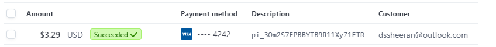

# Testing Markdown File for Decked Out
>  [Decked Out's Live Site](https://decked-out-tcg-store-b1147b8f9a0a.herokuapp.com/)

## Table of Contents
1. [Automated Testing](#automated-testing)
2. [Manual Testing](#manual-testing)
    - [User Verifications](#user-verifications)
    - [Navigation and Site Actions](#navigation-and-site-actions)
    - [Account Security](#account-security)
    - [Automated Emails and Form Submission](#automated-emails-and-form-submission)
    - [Wishlists](#wishlists)
    - [Admin Tasks](#admin-tasks)
    - [Payments](#payments)
3. [Validators](#validators)
    - [HTML source code validation](#html-source-code-validation)
    - [CSS Validation](#css-validation)
    - [Javascript JS Hint Validation](#javascript-js-hint-validation)
    - [Python Linter Validation](#python-linter-validation)
4. [Lighthouse Results](#lighthouse-results)

## Automated Testing 

### Due to time constraints imposed by the project deadline, automated testing was not implemented in this project. However, it's crucial to acknowledge the significance of automated testing in real-world applications. Automated testing not only ensures the reliability and stability of the codebase but also helps in identifying and mitigating potential issues early in the development cycle, thereby saving time and resources in the long run. Recognizing its importance, I am fully committed to integrating automated testing into this project once the grading process is complete. Furthermore, I am eager to incorporate automated testing practices into future code that I develop, as I understand its pivotal role in delivering high-quality and maintainable software solutions.

[Back to Top](#table-of-contents)

## Manual Testing
### User Verifications

#### - Problem Statement: Can a user register for an account?
 ##### Test:
> Register a new user
 ##### Result:
> PASS

#### - Problem Statement: Can a user log in to their account?
 ##### Test:
> Enter valid login credentials (username/email and password) into the login 
 ##### Result:
> PASS

#### - Problem Statement: Can an admin log in to their admin account?
 ##### Test:
> Enter valid login credentials (username/email and password) into the login
 ##### Result:
> PASS

#### - Problem Statement: Can a user log out of their account?
 ##### Test:
> Click the "Log Out" button in the navigation bar or profile settings page.
 ##### Result:
> PASS

#### - Problem Statement: Can a user reset their password?
 ##### Test:
> Click forgot passowrd link, enter details, check for email, click email link, reset password
 ##### Result:
> PASS

[Back to Top](#table-of-contents)

### Navigation and Site Actions

#### - Problem Statement: Can a user navigate from the home page to the All Products 
 ##### Test:
> Click on the All Products link from the home page
 ##### Result:
> PASS

#### - Problem Statement: Is the navigation responsive when selecting the YuGiOh category?
 ##### Test:
> From the home page, select the "YuGiOh" category and verify the page loads correctly
 ##### Result:
> PASS

#### - Problem Statement: Does the Pokémon category link lead to the correct section?
 ##### Test:
> Click on the "Pokémon" link in the navigation bar and check if the Pokémon products are displayed
 ##### Result:
> PASS

#### - Problem Statement: Do the Special Offers display properly when selected from the navigation menu?
 ##### Test:
> Navigate to the Special Offers section and confirm that special promotions and discounted items are listed
 ##### Result:
> PASS

#### - Problem Statement:Can a user utilize the navigation menu to return to the home page from a product details page?
 ##### Test:
> While on a product details page, use the navigation menu to click on the Home link
 ##### Result:
> PASS

#### - Problem Statement: Does the navigation bar collapse and expand correctly in mobile view?
 ##### Test:
> Resize the browser window to a mobile size and test the hamburger menu for proper opening and closing
 ##### Result:
> PASS

#### - Problem Statement: Can a user navigate to the Profile section after logging in?
 ##### Test:
> Log in and click on the My Account followed by selecting Profile from the dropdown menu
 ##### Result:
> PASS

#### - Problem Statement: Can a user navigate from the any page to the bag page
 ##### Test:
> Click the cart icon in the navigation bar on mulitiple pages
 ##### Result:
> PASS

#### - Problem Statement: Can a user use the "Back" button to return to the previous page after navigating to a new section?
 ##### Test:
> Navigate to any section and then use the browser's back button to return to the previous page.
 ##### Result:
> PASS

#### - Problem Statement: Can a user navigate to the FAQ pages from the footer links?
 ##### Test:
> Scroll to the footer and click on the FAQ linkS.
 ##### Result:
> PASS

#### - Problem Statement: Does the hamburger menu on mobile devices display all navigation links?
 ##### Test:
> On a mobile device, tap the hamburger menu icon and check if all navigation links are displayed and clickable.
 ##### Result:
> PASS

#### - Problem Statement: Can a user navigate to the "Checkout" page from the shopping cart without items in the cart? 
 ##### Test:
> With an empty cart, attempt to navigate to the Checkout page by clicking on the cart icon and then the checkout button.
 ##### Result:
> PASS (User is Redirected)

#### - Problem Statement: Can a user filter products by category?
 ##### Test:
> Navigate to the product page and select a category from the filter options.
 ##### Result: 
> PASS

#### - Problem Statement: Can a user sort products by price?
 ##### Test:
> Navigate to the product listing page and select a sorting option price
 ##### Result:
> PASS

#### - Problem Statement: Can a user view product details?
 ##### Test:
>  Navigate to a product page and verify that all relevant details
 ##### Result:
> PASS

#### - Problem Statement: Can a user add a product to their bag?
 ##### Test:
>  Click add to bag on product cards and navigate to bap page to verify
 ##### Result:
> PASS

#### - Problem Statement: Can a user update the quantity of a product in their shopping bag?
 ##### Test:
>  Navigate to the shopping bag page, update the quantity of a product, and verify the subtotal updates accordingly.
 ##### Result:
> PASS

#### - Problem Statement: Can a user proceed to checkout with product in their bag?
 ##### Test:
>   Add products to the shopping bag, proceed to checkout, and verify that the checkout process initiates without errors.
 ##### Result:
> PASS

#### - Problem Statement: Can a user enter a discount code and alter the grand total?
 ##### Test:
>   Enter a valid discount code and check if it alters the order price
 ##### Result:
> PASS

#### - Problem Statement: Can a user view order details after checkout?
 ##### Test:
> Complete the checkout process as a user and navigate to the order confirmation page.
 ##### Result:
> PASS

#### - Problem Statement: Can a user leave a review for a product?
 ##### Test:
> Naviagte to product as non auth user, check if option available(no), log in, naviagate to product never purchased(no), navigate to purchased product(yes), navigate to same product and check if option available(no)
 ##### Result:
> PASS

#### - Problem Statement:Can a user view their order history?
 ##### Test:
> Log in as a user and navigate to the profile and click an order from order history tab.
 ##### Result:
> PASS

#### - Problem Statement: Can a user update their profile information?
 ##### Test:
> Log in as a user and navigate to the profile page, update the default shipping information, and save changes.
 ##### Result:
> PASS

#### - Problem Statement: Can a user update their profile picture
 ##### Test:
> Navigate to the profile page, click choose photo, select photo, click uplaod photo
 ##### Result:
> PASS

[Back to Top](#table-of-contents)

### Account Security

#### - Problem Statement: Can a user log in with incorrect credentials?
 ##### Test:
> Enter incorrect username/email and password into the login form and submit. (NO)
 ##### Result:
> PASS

#### - Problem Statement: Can a non auth user access the profile page?
 ##### Test:
> Using a non auth user navigate to the profile page
 ##### Result:
> PASS

#### - Problem Statement: Can a non auth user access wishlist page
 ##### Test:
> Using a non auth user navigate to the wishlists page
 ##### Result:
> PASS

#### - Problem Statement: Can a non auth user access the history page?
 ##### Test:
> Using a non auth user navigate to the order history page
 ##### Result:
> PASS

#### - Problem Statement: Can a non auth user leave a review on a product?
 ##### Test:
> Using a non auth user navigate to products details, check for option, in url tab navigate to product reviews.
 ##### Result:
> PASS

#### - Problem Statement: Can a non admin user access create a product page?
 ##### Test:
> Using a non admin user navigate to create a product
 ##### Result:
> PASS

#### - Problem Statement: Can a non admin user edit a product? 
 ##### Test:
> Using a non admin user navigate to edit product url
 ##### Result:
> PASS

#### - Problem Statement: Can a non admin user delete a product?
 ##### Test:
> Using a non admin user enter the url path for deleting a product
 ##### Result:
> PASS

#### - Problem Statement: Can a non admin user access the products statistics page?
 ##### Test:
> Using a non admin user navigate to products statistics page
 ##### Result:
> PASS

#### - Problem Statement: Can a non admin user create discount codes?
 ##### Test:
> Using a non admin user navigate to create discount code page
 ##### Result: Can 
> PASS

#### - Problem Statement: Can a non admin user access the create newsletter page
 ##### Test:
> Using a non admin user navigate to the send newsletter page
 ##### Result:
> PASS

#### - Problem Statement: Can a non admin user access the contact form submission page
 ##### Test:
> Using a non admin user navigate to the contact form submission page
 ##### Result:
> PASS

#### - Problem Statement: Can a non admin user 
 ##### Test:
> Using a non admin user
 ##### Result:
> PASS

#### - Problem Statement: Can a non admin user see admin tools options on their profile page?
 ##### Test:
> Using a non admin user navigate to profile page
 ##### Result:
> PASS

#### - Problem Statement: Can a non admin user see admin tools in the account nav dropdown?
 ##### Test:
> Using a non admin user click the account nav dropdown to display site links
 ##### Result:
> PASS
[Back to Top](#table-of-contents)

### Automated Emails and Form Submission

#### - Problem Statement: Can a user sign up to newsletter subscription and recive a confirmation email?
 ##### Test:
> Enter name and email into newsletter form and check email
 ##### Result:
> Pass

#### - Problem Statement: Does a user recieve a sign up verification email upon sign up?
 ##### Test:
> Register a new user, locate email, click link, verify account
 ##### Result:
> Pass

#### - Problem Statement: Can a user submit a contact us form and recive a confirmation email?
 ##### Test:
> Submit conatact form, check email to verify confirmation
 ##### Result:
> Pass

#### - Problem Statement: Does a user recieve an email when succesfully completing an order?
 ##### Test:
> Make a purchase, check email and verify its contents
 ##### Result:
> Pass

#### - Problem Statement: Can an admin submit a newsletter form to push emails to subscribed email address?
 ##### Test:
> Sign up to newsletter, submit newsletter email form from admin newsletter template, check email to confirm
 ##### Result:
> Pass

[Back to Top](#table-of-contents)

### Wishlists

#### - Problem Statement: Can a logged in user add product to wishlist?
 ##### Test:
> navigate to products page, click add to wishlist verify in users profile
 ##### Result: Can a logged in user
> Pass

#### - Problem Statement: Can a logged in user remove product from wishlist?
 ##### Test:
> Navigate to to products page, click remove item from wishlist, verify in users profile
 ##### Result:
> Pass

#### - Problem Statement: Can a logged in user view products in their wishlist from their profile?
 ##### Test:
> Add product to wishlist, navigate to profile, verify product added
 ##### Result:
> Pass

#### - Problem Statement: Can a logged in user access the wishlists page 
 ##### Test:
> Add product to wishlist, navigate to profile, navigate to products wishlist page veify products
 ##### Result:
> Pass

[Back to Top](#table-of-contents)

### Admin Tasks

#### - Problem Statement:Can an admin create a product?
 ##### Test:
> navigate to create products page, fill in and submit form
 ##### Result:
> PASS

#### - Problem Statement: Can an admin edit products?
 ##### Test:
> navigate to product details or edit products page, select edit option, edit the form, submit form
 ##### Result:
> PASS

#### - Problem Statement: Can an admin delete products?
 ##### Test:
> Navigate to product details page, click delete button, confirm delete
 ##### Result:
> PASS

[Back to Top](#table-of-contents)

### Payments

#### - Problem Statement: Can a non auth user make an order?
 ##### Test:
> process an order with a non auth user
 ##### Result:
> PASS

#### - Problem Statement: Can a logged in user make an order?
 ##### Test:
> process an order with a logged in user
 ##### Result:
> PASS

#### - Problem Statement: Are users redirected back to checkout success page after payment
 ##### Test:
> make order and verify redirect location
 ##### Result:
> PASS

#### - Problem Statement: Are all users sent a confirmation email?
 ##### Test:
> Make order with non auth and logged in user and verify email sent
 ##### Result:
> PASS

#### - Problem Statement: Is payment intent created on stripe and has payment succeeded?
 ##### Test:
> Add items to the shopping bag and proceed to checkout, enter valid shipping and billing information, enter test card payment details submit the payment.
Verify if a payment intent is created on the Stripe dashboard.
 ##### Result:
> PASS

[Back to Top](#table-of-contents)

 

[Back to Top](#table-of-contents)

## Validators

### HTML source code validation

[A link to Js Hint Css Validator Site](https://jigsaw.w3.org/css-validator/#validate_by_input)

* The images below repersent the sites styles code passing the tests of the Jigsaw Css Validator

#### - Page: About Us HTML Validator

#### - Page: Checkout HTML Validator

#### - Page: Contact Us HTML Validator

#### - Page: Contact Us Submission HTML Validator

#### - Page: Cookies Policy HTML Validator

#### - Page: Discount Code HTML Validator

#### - Page: Edit Products HTML Validator

#### - Page: Home HTML Validator

#### - Page: Login HTML Validator

#### - Page: Logout HTML Validator

#### - Page: Newsletter HTML Validator

#### - Page: Product Details HTML Validator

#### - Page: Product Reviews HTML Validator

#### - Page: Product Statistics HTML Validator

#### - Page: Products HTML Linter

#### - Page: Profile HTML Validator

#### - Page: Register HTML Validator

#### - Page: Returns Policy HTML Validator 

#### - Page: Shopping Bag HTML Validator

#### - Page: Wishlist HTML Validator

[Back to Top](#table-of-contents)

### CSS Validation

[A link to Js Hint Css Validator Site](https://jigsaw.w3.org/css-validator/#validate_by_input)

* The images below repersent the sites styles code passing the tests of the Jigsaw Css Validator

#### - Results: 

#### - Page: Base CSS

#### - Page: Checkout CSS

#### - Page: Profiles CSS

[Back to Top](#table-of-contents)

### Javascript JS Hint Validation

[A link to Js Hint Javascript Validator Site](https://jshint.com/)

* The images below repersent the sites script code passing the tests of the Js hint Javascript Validator

#### - Results: 

#### - Page: Base HTML Script Scroll Button JSHint

#### - Page: Checkout Stripe Elements JS Hint

#### - Page: Product Sorting JSHint

#### - Page: Profiles Countryfields JSHint

[Back to Top](#table-of-contents)

### Python Linter Validation

[A link to Ci python linter site](https://pep8ci.herokuapp.com/)

* The images below repersent the sites python code passing the tests of the Ci python linter validator

#### - Results: 

#### - Page: Bag App Apps Linter

#### - Page: Bag App Context Linter

#### - Page: Bag App URLs Linter

#### - Page: Bag App Views Linter

#### - Page: Checkout App Apps Linter

#### - Page: Checkout App Forms Linte

#### - Page: Checkout App Models Linter

#### - Page: Checkout App Signals Linter

#### - Page: Checkout App URLs Linter

#### - Page: Checkout App Views Linter

#### - Page: Checkout App Webhooks Handler Linter

#### - Page: Checkout App Webhooks Linter

#### - Page: Home App Admin Linter

#### - Page: Home App Forms Linter

#### - Page: Home App Models Linter

#### - Page: Home App URLs Linter

#### - Page: Home App Views Linter

#### - Page: Newsletter App Admin Linter

#### - Page: Newsletter App Forms Linter

#### - Page: Newsletter App Models Linter

#### - Page: Newsletter App URLs Linter

#### - Page: Products App Admin Linter

#### - Page: Products App Forms Linter

#### - Page: Products App Models Linter

#### - Page: Products App URL Linter

#### - Page: Products App Views Linter

#### - Page: Products App Widgets Linter

#### - Page: Profiles App Admin Linter

#### - Page: Profiles App Forms Linter

#### - Page: Profiles App Models Linter

#### - Page: Profiles App URL Linter

#### - Page: Profiles App Views Linter

#### - Page: Reviews App Admin Linter

#### - Page: Reviews App Forms Linter

#### - Page: Reviews App Models Linter

#### - Page: Reviews App URL Linter

#### - Page: Reviews App URL Linter

[Back to Top](#table-of-contents)

 

[Back to Top](#table-of-contents)

## Lighthouse Results:

As Part of testing my site i put each of my templates through the lighthouse testing service on chromes dev tools the results can be seen below:

* Please note the page url in the top righthand corner

#### - Results:

[Back to Top](#table-of-contents)

[Back to Top](#table-of-contents)