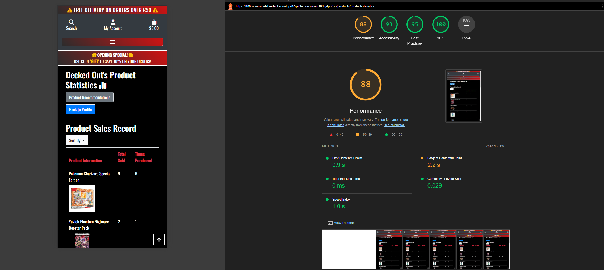

# Testing Markdown File for Decked Out
>  [Decked Out's Live Site](https://decked-out-tcg-store-b1147b8f9a0a.herokuapp.com/)

## Table of Contents
1. [Automated Testing](#automated-testing)
2. [Manual Testing](#manual-testing)
    - [User Verifications](#user-verifications)
    - [Navigation](#navigation)
    - [Account Security](#account-security)
    - [Automated Emails](#automated-emails)
    - [Wishlists](#wishlists)
    - [Admin Tasks](#admin-tasks)
    - [Payments](#payments)
3. [Validators](#validators)
    - [HTML source code validation](#html-source-code-validation)
    - [CSS Validation](#css-validation)
    - [Javascript JS Hint Validation](#javascript-js-hint-validation)
    - [Python Linter Validation](#python-linter-validation)
4. [Lighthouse Results](#lighthouse-results)

## Automated Testing 

[Back to Top](#table-of-contents)

## Manual Testing
### User Verifications

#### - Problem Statement: Can a user register for an account?
 ##### Test:
> Register a new user
 ##### Result:
> PASS

[Back to Top](#table-of-contents)

### Navigation

#### - Problem Statement:
 ##### Test:
> 
 ##### Result:
> 

[Back to Top](#table-of-contents)

### Account Security

#### - Problem Statement:
 ##### Test:
> 
 ##### Result:
> 

[Back to Top](#table-of-contents)

### Automated Emails

#### - Problem Statement:
 ##### Test:
> 
 ##### Result:
> 

[Back to Top](#table-of-contents)

### Wishlists

#### - Problem Statement:
 ##### Test:
> 
 ##### Result:
> 

[Back to Top](#table-of-contents)

### Admin Tasks

#### - Problem Statement:
 ##### Test:
> 
 ##### Result:
> 

[Back to Top](#table-of-contents)

### Payments

#### - Problem Statement:
 ##### Test:
> 
 ##### Result:
> 

[Back to Top](#table-of-contents)

 

[Back to Top](#table-of-contents)

## Validators

### HTML source code validation

[A link to Js Hint Css Validator Site](https://jigsaw.w3.org/css-validator/#validate_by_input)

* The images below repersent the sites styles code passing the tests of the Jigsaw Css Validator

#### - Page: About Us HTML Validator

#### - Page: Checkout HTML Validator

#### - Page: Contact Us HTML Validator

#### - Page: Contact Us Submission HTML Validator

#### - Page: Cookies Policy HTML Validator

#### - Page: Discount Code HTML Validator

#### - Page: Edit Products HTML Validator

#### - Page: Home HTML Validator

#### - Page: Login HTML Validator

#### - Page: Logout HTML Validator

#### - Page: Newsletter HTML Validator

#### - Page: Product Details HTML Validator

#### - Page: Product Reviews HTML Validator

#### - Page: Product Statistics HTML Validator

#### - Page: Products HTML Linter

#### - Page: Profile HTML Validator

#### - Page: Register HTML Validator

#### - Page: Returns Policy HTML Validator 

#### - Page: Shopping Bag HTML Validator

#### - Page: Wishlist HTML Validator

[Back to Top](#table-of-contents)

### CSS Validation

[A link to Js Hint Css Validator Site](https://jigsaw.w3.org/css-validator/#validate_by_input)

* The images below repersent the sites styles code passing the tests of the Jigsaw Css Validator

#### - Results: 

#### - Page: Base CSS

#### - Page: Checkout CSS

#### - Page: Profiles CSS

[Back to Top](#table-of-contents)

### Javascript JS Hint Validation

[A link to Js Hint Javascript Validator Site](https://jshint.com/)

* The images below repersent the sites script code passing the tests of the Js hint Javascript Validator

#### - Results: 

#### - Page: Base HTML Script Scroll Button JSHint

#### - Page: Checkout Stripe Elements JS Hint

#### - Page: Product Sorting JSHint

#### - Page: Profiles Countryfields JSHint

[Back to Top](#table-of-contents)

### Python Linter Validation

[A link to Ci python linter site](https://pep8ci.herokuapp.com/)

* The images below repersent the sites python code passing the tests of the Ci python linter validator

#### - Results: 

#### - Page: Bag App Apps Linter

#### - Page: Bag App Context Linter

#### - Page: Bag App URLs Linter

#### - Page: Bag App Views Linter

#### - Page: Checkout App Apps Linter

#### - Page: Checkout App Forms Linte

#### - Page: Checkout App Models Linter

#### - Page: Checkout App Signals Linter

#### - Page: Checkout App URLs Linter

#### - Page: Checkout App Views Linter

#### - Page: Checkout App Webhooks Handler Linter

#### - Page: Checkout App Webhooks Linter

#### - Page: Home App Admin Linter

#### - Page: Home App Forms Linter

#### - Page: Home App Models Linter

#### - Page: Home App URLs Linter

#### - Page: Home App Views Linter

#### - Page: Newsletter App Admin Linter

#### - Page: Newsletter App Forms Linter

#### - Page: Newsletter App Models Linter

#### - Page: Newsletter App URLs Linter

#### - Page: Products App Admin Linter

#### - Page: Products App Forms Linter

#### - Page: Products App Models Linter

#### - Page: Products App URL Linter

#### - Page: Products App Views Linter

#### - Page: Products App Widgets Linter

#### - Page: Profiles App Admin Linter

#### - Page: Profiles App Forms Linter

#### - Page: Profiles App Models Linter

#### - Page: Profiles App URL Linter

#### - Page: Profiles App Views Linter

#### - Page: Reviews App Admin Linter

#### - Page: Reviews App Forms Linter

#### - Page: Reviews App Models Linter

#### - Page: Reviews App URL Linter

#### - Page: Reviews App URL Linter

[Back to Top](#table-of-contents)

 

[Back to Top](#table-of-contents)

## Lighthouse Results:

As Part of testing my site i put each of my templates through the lighthouse testing service on chromes dev tools the results can be seen below:

* Please note the page url in the top righthand corner

#### - Results:

[Back to Top](#table-of-contents)

[Back to Top](#table-of-contents)